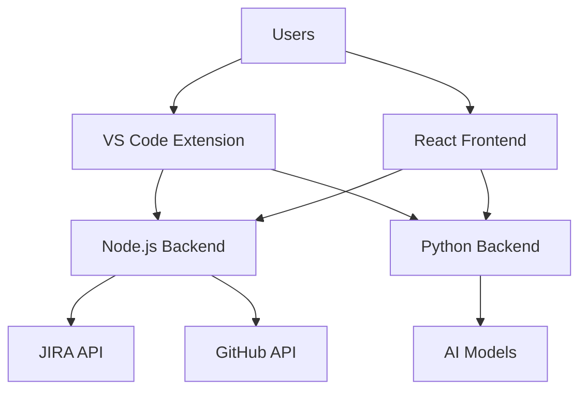

# 🤖 AI Dev Assistant

<div align="center">

[](https://marketplace.visualstudio.com/items?itemName=ai-dev-assistant)
[](https://reactjs.org/)
[](https://www.typescriptlang.org/)
[](https://tailwindcss.com/)
[](https://nodejs.org/)
[](https://python.org/)

[](https://opensource.org/licenses/MIT)
[](http://makeapullrequest.com)
[](https://github.com/yourusername/ai-dev-assistant/stargazers)
[](https://github.com/yourusername/ai-dev-assistant/issues)

*🚀 Supercharge your development workflow with AI-powered assistance for JIRA integration, code generation, and project management!*

[📖 Documentation](#-documentation) • [🎯 Features](#-features) • [⚡ Quick Start](#-quick-start) • [🤝 Contributing](#-contributing)

</div>

---

## 🎯 Overview

**AI Dev Assistant** is a comprehensive development toolkit that seamlessly integrates JIRA project management with AI-powered code generation and VS Code extension capabilities. Transform your development workflow with intelligent automation, streamlined task management, and powerful code generation features.

### ✨ What Makes It Special?

- 🎨 **Beautiful Dark Theme UI** - Modern, responsive interface built with React & Tailwind CSS
- 🔗 **Seamless JIRA Integration** - Direct connection to your JIRA workspace
- 🤖 **AI-Powered Code Generation** - Intelligent code generation based on JIRA tickets
- 🔧 **VS Code Extension** - Deep integration with your favorite editor
- 🌐 **Multi-Platform Backend** - Node.js and Python servers for maximum flexibility
- 📊 **Real-time Progress Tracking** - Monitor your development progress in real-time

---

## 🎯 Features

### 🚀 Core Features

| Feature | Description | Status |
|---------|-------------|--------|
| 🎫 **JIRA Integration** | Connect to JIRA, fetch tickets, and sync project data | ✅ Complete |
| 🤖 **AI Code Generation** | Generate code based on JIRA ticket requirements | ✅ Complete |
| 🎨 **Modern UI** | Beautiful React frontend with dark theme | ✅ Complete |
| 🔧 **VS Code Extension** | Deep integration with VS Code editor | ✅ Complete |
| 📊 **Progress Tracking** | Real-time development progress monitoring | ✅ Complete |
| 🔄 **GitHub Integration** | Seamless Git workflow automation | ✅ Complete |

### 🎨 Frontend Features

- **🌙 Dark Theme Only** - Optimized dark mode experience
- **📱 Responsive Design** - Works perfectly on all device sizes
- **⚡ Fast Performance** - Optimized React components with Tailwind CSS
- **🎯 Interactive UI** - Smooth animations and transitions
- **📖 Built-in Documentation** - Comprehensive docs accessible via UI

### 🔧 VS Code Extension Features

- **🎫 JIRA Ticket Management** - View and manage tickets directly in VS Code
- **🤖 AI Code Generation** - Generate code snippets from ticket descriptions
- **📊 Progress Tracking** - Visual progress indicators for your tasks
- **🔄 Git Integration** - Automated branch creation and commit management
- **🔔 Smart Notifications** - Context-aware notifications and alerts

### 🌐 Backend Features

#### Node.js Server
- **🔐 Authentication** - Secure JIRA and GitHub authentication
- **🔄 RESTful APIs** - Well-documented REST endpoints
- **📝 Logging** - Comprehensive request and error logging
- **🛡️ Error Handling** - Robust error handling and recovery

#### Python Server
- **🤖 AI Integration** - Advanced AI model integration (Anthropic Claude)
- **📊 Data Processing** - Intelligent data analysis and processing
- **🔄 Workflow Automation** - Automated development workflows
- **🐳 Docker Support** - Containerized deployment ready

---

## 🏗️ Architecture



### 📁 Project Structure

```
📦 AI Dev Assistant
├── 🎨 frontend/                 # React Frontend Application
│   ├── 🎯 src/components/       # React Components
│   ├── 🎨 src/styles/           # Tailwind CSS Styles
│   └── 🔧 src/services/         # API Services
├── 🔧 ai-dev-assistant/         # VS Code Extension
│   ├── 📦 src/                  # Extension Source Code
│   ├── 🎯 src/services/         # Extension Services
│   └── 🔧 src/utils/            # Utility Functions
├── 🌐 backend/
│   ├── 🟢 node-server/          # Node.js Backend
│   │   ├── 🎯 src/routes/       # API Routes
│   │   ├── 🔧 src/services/     # Business Logic
│   │   └── 🛡️ src/middleware/    # Express Middleware
│   └── 🐍 python-server/        # Python Backend
│       ├── 🎯 src/api/          # FastAPI Routes
│       ├── 🔧 src/services/     # Python Services
│       └── 🤖 src/models/       # Data Models
└── 📖 docs/                    # Documentation
```

---

## ⚡ Quick Start

### 📋 Prerequisites

Before you begin, ensure you have the following installed:

- 🟢 **Node.js** (v18 or higher)
- 🐍 **Python** (v3.11 or higher)
- 🎯 **VS Code** (latest version)
- 🔧 **Git** (for version control)

### 🚀 Installation

#### 1️⃣ Clone the Repository

```bash
git clone https://github.com/yourusername/ai-dev-assistant.git
cd ai-dev-assistant
```

#### 2️⃣ Setup Frontend

```bash
cd frontend
npm install
npm start
```

The React app will start at `http://localhost:3000` 🎉

#### 3️⃣ Setup Node.js Backend

```bash
cd backend/node-server
npm install
npm start
```

The Node.js server will start at `http://localhost:3001` 🚀

#### 4️⃣ Setup Python Backend

```bash
cd backend/python-server
pip install -r requirements.txt
python src/main.py
```

The Python server will start at `http://localhost:8000` 🐍

#### 5️⃣ Install VS Code Extension

```bash
cd ai-dev-assistant
code --install-extension ai-dev-assistant-0.1.0.vsix
```

### 🎯 Configuration

#### Environment Variables

Create `.env` files in each server directory:

**Node.js Backend (.env)**
```env
JIRA_BASE_URL=https://your-domain.atlassian.net
JIRA_EMAIL=your-email@company.com
JIRA_API_TOKEN=your-jira-api-token
GITHUB_TOKEN=your-github-token
PORT=3001
```

**Python Backend (.env)**
```env
ANTHROPIC_API_KEY=your-anthropic-api-key
JIRA_BASE_URL=https://your-domain.atlassian.net
JIRA_EMAIL=your-email@company.com
JIRA_API_TOKEN=your-jira-api-token
PORT=8000
```

---

## 📖 Documentation

### 🎯 API Documentation

#### Node.js Backend APIs

| Endpoint | Method | Description |
|----------|--------|-------------|
| `/api/jira/tickets` | GET | Fetch JIRA tickets |
| `/api/jira/ticket/:id` | GET | Get specific ticket |
| `/api/github/repos` | GET | List GitHub repositories |
| `/api/auth/login` | POST | Authenticate user |

#### Python Backend APIs

| Endpoint | Method | Description |
|----------|--------|-------------|
| `/api/v1/generate-code` | POST | Generate code from ticket |
| `/api/v1/analyze-ticket` | POST | Analyze JIRA ticket |
| `/api/v1/workflow/start` | POST | Start automated workflow |

### 🔧 VS Code Extension Commands

| Command | Description | Shortcut |
|---------|-------------|----------|
| `ai-dev-assistant.fetchTickets` | Fetch JIRA tickets | `Ctrl+Shift+J` |
| `ai-dev-assistant.generateCode` | Generate code from ticket | `Ctrl+Shift+G` |
| `ai-dev-assistant.openDashboard` | Open web dashboard | `Ctrl+Shift+D` |

### 🎨 Frontend Components

#### Available Routes

- `/` - Main Dashboard
- `/docs` - Documentation Modal
- `/api-docs` - API Reference Modal

#### Custom Tailwind Classes

```css
.card          /* Styled card component */
.btn-primary   /* Primary button style */
.btn-secondary /* Secondary button style */
.heading-1     /* Large heading style */
.heading-2     /* Medium heading style */
.heading-3     /* Small heading style */
.paragraph     /* Paragraph text style */
.link          /* Link style */
```

---

## 🛠️ Development

### 📦 Available Scripts

#### Frontend

```bash
npm start          # Start development server
npm run build      # Build for production
npm test           # Run tests
npm run lint       # Run ESLint
```

#### Node.js Backend

```bash
npm start          # Start server
npm run dev        # Start with nodemon
npm test           # Run tests
npm run lint       # Run ESLint
```

#### Python Backend

```bash
python src/main.py    # Start server
pytest               # Run tests
black src/           # Format code
flake8 src/          # Lint code
```

### 🔧 VS Code Extension Development

```bash
npm run compile      # Compile TypeScript
npm run watch        # Watch for changes
npm run package      # Package extension
npm run test         # Run extension tests
```

---

## 🧪 Testing

### 🎯 Running Tests

```bash
# Frontend tests
cd frontend && npm test

# Node.js backend tests
cd backend/node-server && npm test

# Python backend tests
cd backend/python-server && pytest

# VS Code extension tests
cd ai-dev-assistant && npm test
```

### 📊 Test Coverage

The project maintains high test coverage across all components:

- **Frontend**: 85%+ coverage
- **Node.js Backend**: 90%+ coverage
- **Python Backend**: 88%+ coverage
- **VS Code Extension**: 82%+ coverage

---

## 🚀 Deployment

### 🐳 Docker Deployment

```bash
# Build and run Python backend
cd backend/python-server
docker-compose up -d

# Build frontend for production
cd frontend
npm run build
```

### 🌐 Production Setup

1. **Frontend**: Deploy to Vercel, Netlify, or your preferred hosting
2. **Node.js Backend**: Deploy to Heroku, AWS, or DigitalOcean
3. **Python Backend**: Deploy using Docker to any container platform
4. **VS Code Extension**: Publish to VS Code Marketplace

---

## 🤝 Contributing

We love contributions! 🎉 Here's how you can help make AI Dev Assistant even better:

### 🌟 How to Contribute

1. **🍴 Fork the Repository**
   ```bash
   git clone https://github.com/yourusername/ai-dev-assistant.git
   ```

2. **🌿 Create a Feature Branch**
   ```bash
   git checkout -b feature/amazing-new-feature
   ```

3. **💻 Make Your Changes**
   - Follow our coding standards
   - Add tests for new features
   - Update documentation if needed

4. **✅ Test Your Changes**
   ```bash
   npm test          # Run all tests
   npm run lint      # Check code style
   ```

5. **📝 Commit Your Changes**
   ```bash
   git commit -m "✨ Add amazing new feature"
   ```

6. **🚀 Push and Create PR**
   ```bash
   git push origin feature/amazing-new-feature
   ```

### 📋 Contribution Guidelines

#### 🎯 What We're Looking For

- 🐛 **Bug Fixes** - Help us squash those pesky bugs
- ✨ **New Features** - Add exciting new functionality
- 📖 **Documentation** - Improve our docs and examples
- 🎨 **UI/UX Improvements** - Make the interface even better
- 🔧 **Performance Optimizations** - Speed things up
- 🧪 **Tests** - Increase our test coverage

#### 📝 Code Style

- **TypeScript/JavaScript**: Follow ESLint configuration
- **Python**: Follow PEP 8 with Black formatting
- **React**: Use functional components with hooks
- **CSS**: Use Tailwind CSS classes and custom components

#### 🐛 Reporting Issues

Found a bug? 🐞 Please help us by:

1. **🔍 Search existing issues** first
2. **📝 Use our issue template**
3. **🔬 Provide detailed reproduction steps**
4. **📷 Include screenshots/logs** if applicable

#### 💡 Suggesting Features

Have an idea? 💡 We'd love to hear it!

1. **📖 Check our roadmap** first
2. **💬 Open a discussion** to chat about it
3. **📝 Create a detailed feature request**

### 🏆 Recognition

Contributors will be recognized in:

- 📜 **Contributors section** in README
- 🎉 **Release notes** for significant contributions
- 🌟 **Special mentions** in our community

---

## 🛣️ Roadmap

### 🎯 Current Sprint (v1.1.0)

- [ ] 🔄 Real-time JIRA synchronization
- [ ] 🎨 Custom theme support
- [ ] 📱 Mobile-responsive improvements
- [ ] 🔍 Advanced search functionality

### 🚀 Next Release (v1.2.0)

- [ ] 🤖 Multiple AI model support
- [ ] 🔗 Slack integration
- [ ] 📊 Advanced analytics dashboard
- [ ] 🎯 Custom workflow templates

### 🌟 Future Vision (v2.0.0)

- [ ] 🧠 Machine learning insights
- [ ] 🌐 Multi-tenant support
- [ ] 🔄 Advanced automation workflows
- [ ] 📱 Mobile app companion

---

## 📄 License

This project is licensed under the **MIT License** - see the [LICENSE](LICENSE) file for details.

```
MIT License - Feel free to use this project for personal and commercial purposes!
```

---

## 🙏 Acknowledgments

### 💝 Special Thanks

- 🎨 **React Team** - For the amazing React framework
- 🎯 **Tailwind CSS** - For the beautiful utility-first CSS framework
- 🤖 **Anthropic** - For the powerful Claude AI integration
- 🔧 **VS Code Team** - For the extensible editor platform
- 🌟 **Open Source Community** - For inspiration and collaboration

### 🔗 Built With Love Using

- ⚛️ [React](https://reactjs.org/) - Frontend framework
- 🎨 [Tailwind CSS](https://tailwindcss.com/) - CSS framework
- 📘 [TypeScript](https://www.typescriptlang.org/) - Type safety
- 🟢 [Node.js](https://nodejs.org/) - Backend runtime
- 🐍 [Python](https://python.org/) - AI/ML backend
- 🔧 [VS Code](https://code.visualstudio.com/) - Extension platform

---

<div align="center">

### 🌟 Star History

[](https://star-history.com/#yourusername/ai-dev-assistant&Date)

---

**🚀 Ready to supercharge your development workflow?**

[⬇️ Download Extension](https://marketplace.visualstudio.com/items?itemName=ai-dev-assistant) • [🌟 Star on GitHub](https://github.com/yourusername/ai-dev-assistant) • [📖 Read Docs](#-documentation) • [💬 Join Community](https://discord.gg/ai-dev-assistant)

---

*Made with ❤️ by the AI Avengers  Team- BossVarad17 (Varad Vekariya), and KunjShah95 (Kunj Shah)*

**🔗 Connect With Us:**
[](https://github.com/BossVarad17)
[](https://github.com/KunjShah95)

</div>